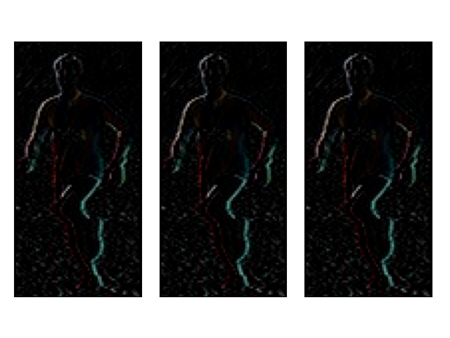

# Edge Detectors in OpenCV

Implementations of the selected image processing algorithms in OpenVC to detect edges, corners and more. These can be used to extract features from images.

For explanations along with the code see [post 1](https://www.neuralception.com/featureextractors-1/) and [post 2](https://www.neuralception.com/featureextractors-2/) on my website. A high-level explanation of SIFT and HOG is available [here](https://www.neuralception.com/objectdetection-traditionalfeatures).

___________________________________

### Sobel filter

Calculates an approximation of the intensity derivative.

### Harris corner detector

Detects corners by calculating a score from intensity gradients in a sliding window fashion.

### Scale Invariant Feature Transform

Popular traditional algorithm for object recognition. Identifies scale invariant features in a cascade by using a Gaussian image pyramid. Once identified the keypoints can be used to recognize partially occluded objects using a k-nn approach.

### Histogram of Oriented Gradients

Another traditional image recognition algorithm. Default parameters are tailored to detect pedestrians. Aggregates pixel intensity gradients for image patches in histograms to encode the boundaries of objects, here pedestrians.

