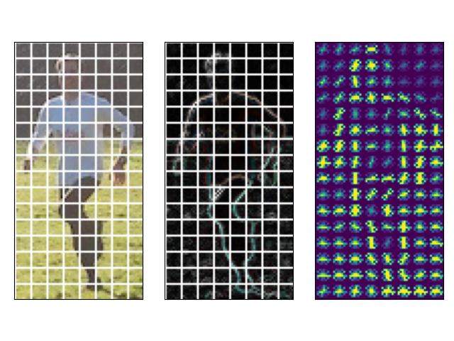

# Edgedetectors
Implementations of the selected image processing algorithms in OpenVC to detect edges, corners and more. These can be used to extract features from images.

**Sobel filter**
Calculates an approximation of the intensity derivative.

**Harris corner detector**
Detects corners by calculating a score from intensity gradients in a sliding window fashion.

**Scale Invariant Feature Transform**
Popular traditional algorithm for object recognition. Identifies scale invariant features in a cascade by using a Gaussian image pyramid. Once identified the keypoints can be used to recognize partially occluded objects using a k-nn approach.

**Histogram of Oriented Gradients**
Another traditional image recognition algorithm. Default parameters are tailored to detect pedestrians. Aggregates intensity gradients for image patches in histograms to encode the 

